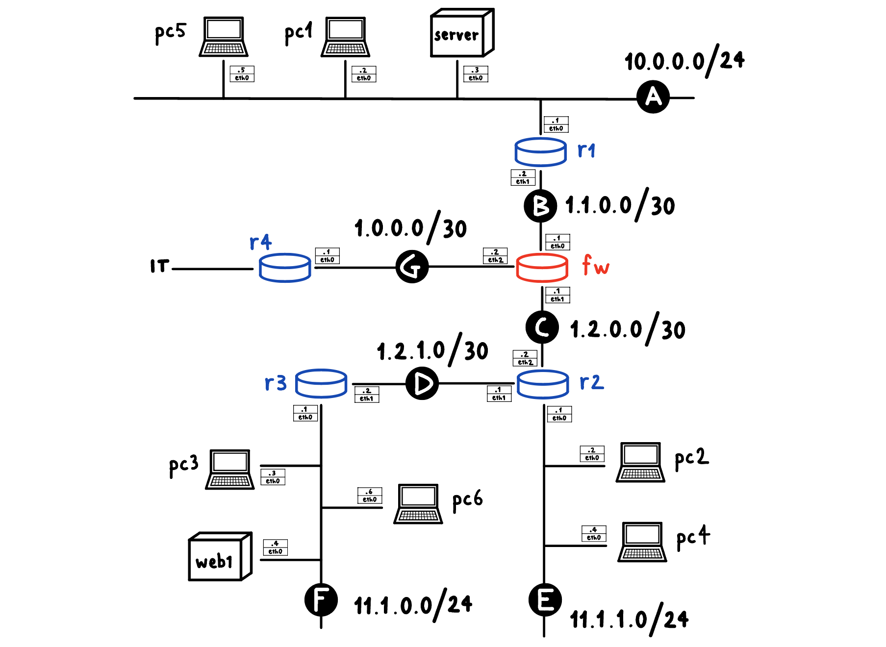

# Vuln2ATT&CK project

Vuln2ATT&CK was designed to analyze the most common vulnerabilities affecting standard services active on network hosts.
Its goal is to map each vulnerability (CVE) to the techniques or tactics from the ATT&CK matrix used to exploit it. This also allows a basic user to understand the security status of their system or network, as well as provide a direct reference for the best mitigation strategies.

The project includes a lab developed using the [Kathara tool](https://github.com/KatharaFramework/Kathara), within which the Caldera server and a series of other hosts are active for testing purposes.

It utilizes the [MITRE Caldera framework](https://github.com/mitre/caldera), combined with the [Pathfinder plugin](https://github.com/center-for-threat-informed-defense/caldera_pathfinder), to perform scans and collect and data.

The [CVE-ListV5](https://github.com/CVEProject/cvelistV5) repository and [CAPECList](https://capec.mitre.org/index.html) are used in combination as the database for the mappings.

## Network topology and service table



| Host    | Service   | Version    | Ports                  | Source                                                                      |
|---------|-----------|------------|------------------------|-----------------------------------------------------------------------------|
| pc1     | Tomcat    | 9.0.30     | 8080,8009              | [Ref](https://github.com/vulhub/vulhub/tree/master/tomcat/CVE-2020-1938)    |
| pc2     | libssh    | 0.8.1      | 2222,22                | [Ref](https://github.com/vulhub/vulhub/tree/master/libssh/CVE-2018-10933)   |
| pc3     | openssl   | 7.6        | 22                     | [Ref](https://vulners.com/cve/CVE-2018-15473)                               |
| pc4     | ofbiz     | 18.12.15   | 8443,5005              | [Ref](https://github.com/vulhub/vulhub/tree/master/ofbiz/CVE-2024-45195)    |
| pc5     | saltstack | 3.0.2      | 8000,2222,22,4505,4506 | [Ref](https://github.com/vulhub/vulhub/tree/master/saltstack/CVE-2020-16846)|
| pc6     | ofbiz     | 17.12.01   | 8443,5005              | [Ref](https://github.com/vulhub/vulhub/tree/master/ofbiz/CVE-2020-9496)     |
| pc7     | ofbiz     | 18.12.09   | 8443,5005              | [Ref](https://github.com/vulhub/vulhub/tree/master/ofbiz/CVE-2023-49070)    |

## Requirements
* Any Linux or MacOS
* Python 3.12+ (with Pip3)
* Katharà

## Installation
* Clone this repository:
        `git clone https://github.com/ireproces/Vuln2ATT-CK.git`
* Clone the cvelistV5 repository into the same directory:
        `git clone https://github.com/CVEProject/cvelistV5.git`

# User Guide
## Phase 1: Lab Setup 

1. STARTS ALL TESTING HOSTS
Navigate to the directory /lab and execute this commands from within
    ```Bash
    kathara lstart
    kathara lconfig --name server --add A
    ```
    - wait for all hosts to start correctly before executing the second command

2. SET CALDERA SERVER HOST CONFIGURATION
Execute this commands from the server host terminal
    ```Bash
    bash configure_iface.sh
    ```

## Phase 2: Scans Setup

1. Access the address `http://localhost:8888` from your default browser and login as red user - username and password are specified in the file `/lab/server/caldera/conf/local.yml`

2. From the Caldera homepage select the Pathfinder plugin and fill the Scan view fields as follows:  
    - Select a scanner: nmap  
    - Target specification: IP address or subnet to scan (e.g. 11.1.0.0/24)  
    - Scanner script: [nmap-vulners](https://github.com/vulnersCom/nmap-vulners/tree/bbf53dd085f8d810921ee00ccf85bdb329d59514)
    - Ports: insert some common ports (refer to the service table for more details)
    - No ping: selected
    - Report name: unique
    
    press the button to start the scan and check the output to track its status

3. Once the scan is complete, go to the Reports view to generate the graph of detected vulnerabilities and download the generated report

4. Move the reports from the current folder to the /reports folder within the Vuln2ATT&CK project - you should already see the `mapper.py` program inside

## Phase 3: Mapping

1. From the /reports folder, run the command to execute the program
    ```Bash
    python3 mapper.py
    ```