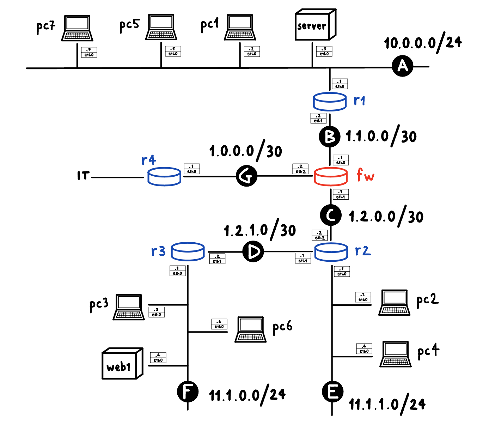

# Blacksheep project

Blacksheep was designed to analyze the most common vulnerabilities affecting standard services active on network hosts.

It utilizes the [MITRE Caldera framework](https://github.com/mitre/caldera), combined with the [Pathfinder plugin](https://github.com/center-for-threat-informed-defense/caldera_pathfinder), to collect and process the acquired data.

The project includes a lab developed using the [Kathara tool](https://github.com/KatharaFramework/Kathara), within which the Caldera server and a series of other hosts are active for testing purposes.

## Network topology and service table



| Host    | Service   | Version    | Ports                  | Source                                                                      |
|---------|-----------|------------|------------------------|-----------------------------------------------------------------------------|
| pc1     | Tomcat    | 9.0.30     | 8080,8009              | [Ref](https://github.com/vulhub/vulhub/tree/master/tomcat/CVE-2020-1938)    |
| pc2     | libssh    | 0.8.1      | 2222,22                | [Ref](https://github.com/vulhub/vulhub/tree/master/libssh/CVE-2018-10933)   |
| pc3     | openssl   | 7.6        | 22                     | [Ref](https://vulners.com/cve/CVE-2018-15473)                               |
| pc4     | saltstack | 3002       | 8000,2222,22,4505,4506 | [Ref](https://github.com/vulhub/vulhub/tree/master/saltstack/CVE-2020-16846)|
| pc5     |  ...      |     ...    |    ...                 |                    ...                                                      |
| pc6     |  ...      |     ...    |    ...                 |                    ...                                                      |

## Installation guide

1. clone this repository into your local directory

2. navigate to the directory /Blacksheep/lab and execute this command from within
    ```Bash
    kathara lstart
    ```

3. when all the hosts are up, from the server terminal, execute this command
    ```Bash
    echo "nameserver 8.8.8.8" > /etc/resolv.conf
    ```

4. access the address `http://localhost:8888` from your default browser and login as red user - username and password are specified in the file `/lab/server/caldera/conf/local.yml`

5. select the Pathfinder plugin and fill the Scan view fields as follows:  
    - Select a scanner: nmap  
    - Target specification: IP address or subnet to scan (e.g. 11.1.0.0/24)  
    - Scanner script: [nmap-vulners](https://github.com/vulnersCom/nmap-vulners/tree/bbf53dd085f8d810921ee00ccf85bdb329d59514)
    - Ports: specify some common ports (refer to the service table for more details)
    - No ping: selected
    - Report name: unique
    
    Press the button to start the scan and check the output to track its status

6. once the scan is complete, go to the Reports view to generate the graph of detected vulnerabilities